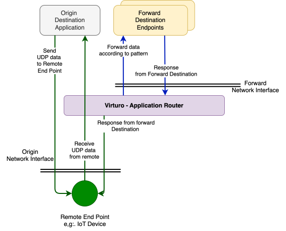

# VIRTURO - Virtual router

Application level IP packets router

## Motivation

Sometimes there is a need to split or redirect IP based traffic (UDP in particular) or portion of it to end points
other than the designated one.
<br>
Typically, it can be done using original application by forwarding data to other destinations, for example, adding more sockets.
In reality, sometimes that is not possible due to closed source or legacy systems with high costs of maintenance.
<br>
Another option would be using buit-in bridge utilities depending on operating system, however, this solution does not provides application level routing.
<br>
<br>
This application solves this problem by acting as "permissive" transparent "man in the middle", capturing
inbound traffic of interest from origin and forwards it to other destination IP end points.
<br>
Additionally, the application can return response from forwarded destinations to origin (under certain conditions).

## Architecture

Illustration of typical architecture

[](https://github.com/IoTPrjAdmin/Virturo/docs/VirturoPrinciple.svg)

## Main Functionality

Route detected traffic from origin network interface given by IP address and port to destination.

- Listen to network interface at specific port
- Detect specific patterns of received data frames, such as preamble of application frames
- Route detected data to defined end point
- Allow rest of the data to pass through the destination

## Application Configuration

- Network interface and destination port to listen on
- Forward IP address and port, with network interface to send from.
- By default uses config.json from running folder.

Example of configuration file, by default `config.json` file
```
{
    "settings": {
        // Timeout for forward entry until expiry
        // Entries with expired timeout since last communication will be dropped.
        // It won't be possible to response to origin from forward
        // until reception of next frame from origin.
        "fwd_entry_ttl_sec" : 60
    },
    "forward_rules": [
        {
            // Origin interface to capture packets on
            "org_interface" : "en0",
            // Destination port to which packets are routed
            "org_dst_port": 6233,
            // Interface, to forward packets from
            "fwd_interface" : "lo0",
            // list of rules to forward according to patterns
            "org_patterns" : [
                {
                    // Pattern to detect as hex string, can not be empty
                    "pattern_hex": "41424344",
                    // Destination IP address to forward packet to
                    "fwd_dst_ip" : "127.0.0.1",
                    // Destination port to forward packet to
                    "fwd_dst_port": 6235
                },
                {
                    "pattern_hex": "4142434445",
                    "fwd_dst_ip" : "127.0.0.1",
                    "fwd_dst_port": 6236
                }
            ]
        }
    ]
}
```

Configuration file can be supplied by `--config` command line parameter.

## Prerequisites

Application uses [pnet crate](https://docs.rs/pnet/latest/pnet/) all its dependencies must be setup.

## Run

Run executable with administrator privileges.
Make sure the specified ports in configuration files are enabled in firewall or
network access for the application is enabled (Typically with MacOs)

To supply configuration file other than default :
`virturo --config <config_file.json>`
<br>
To list available network interfaces, run:
`sudo (or as administrator on Windows) virturo --list`

## Running on Windows OS

Follow instruction here: https://github.com/libpnet/libpnet

When building the project Antivirus (or alike) may block the build process, due to detection of an invasive code of the pnet library and use of pcap drivers,
disable Antivirus or exclude the build folder from the scan.

Specifying network interfaces on Windows requires full name as written in registry,
for example:
`\Device\NPF_{4E273621-5161-46C8-895A-48D0E52A0B83}`

To get available interfaces with their names, run this application with `--list` argument as administrator
`virturo --list`


## Examples

- config_examples folder contains configuration examples

## Important

This application is in Proof of Concept phase (PoC) and still far from production ready
with many missing features.

## Issues or Questions

Please submit any questions as issues, or email to tech@iotproject.io